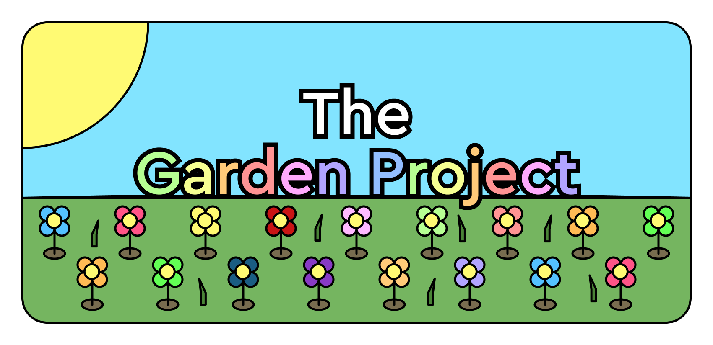

<h1 align="center"></h1>
<h4 align="center">A simple, idle-style flower planting game. Written entirely in <a href="http://p5js.org">p5.js</a>.</h4>

You can give it a go <a href="https://squigglesdev.github.io/Garden-Project">here</a>!

## Roadmap
- [x] Add apple tree plant type
- [x] Save system
- [ ] Prestige system
- [ ] Music
- [ ] SFX
- [x] Touch support
- [x] Falling apples
- [ ] Saves append timestamp
- [ ] Enemies